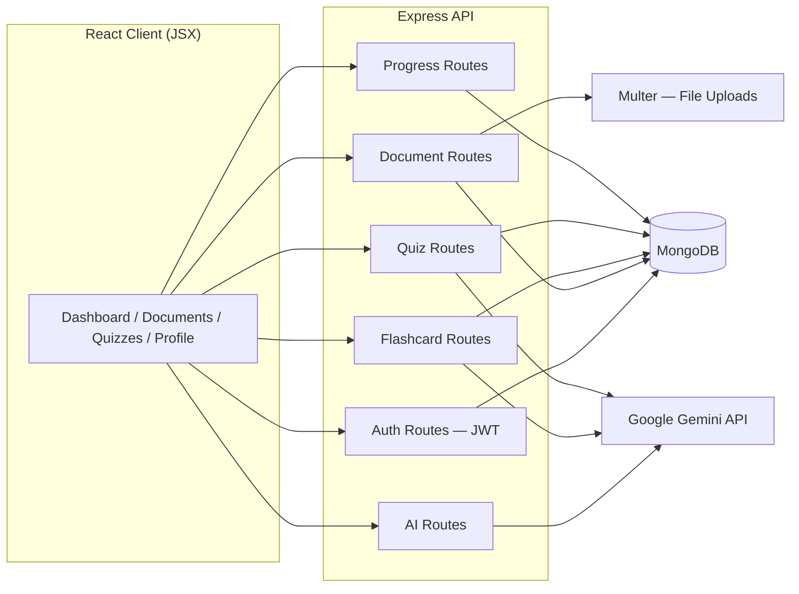
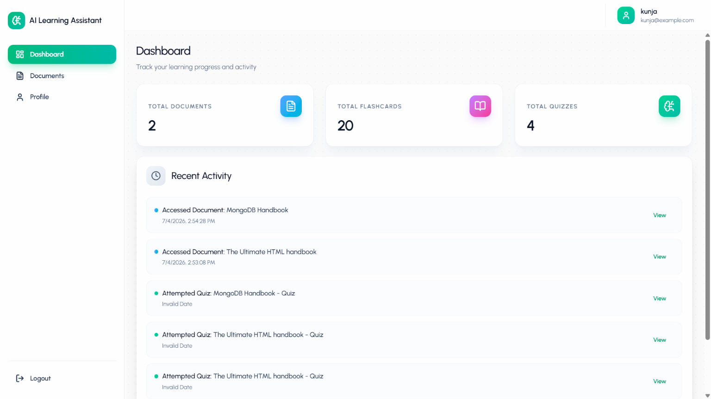
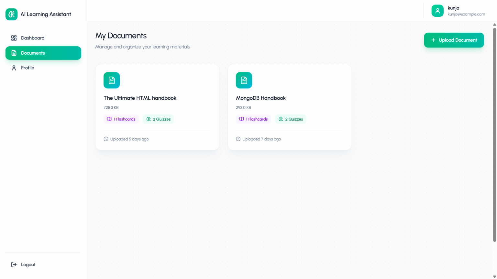
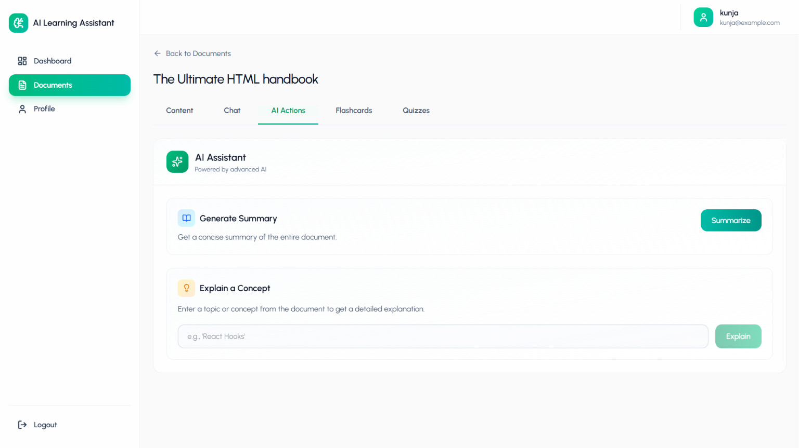
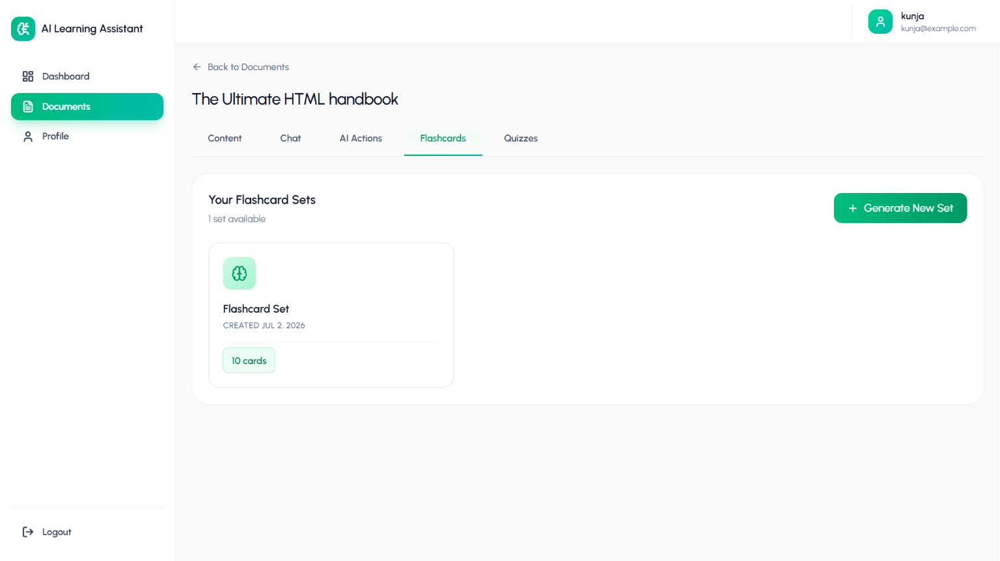
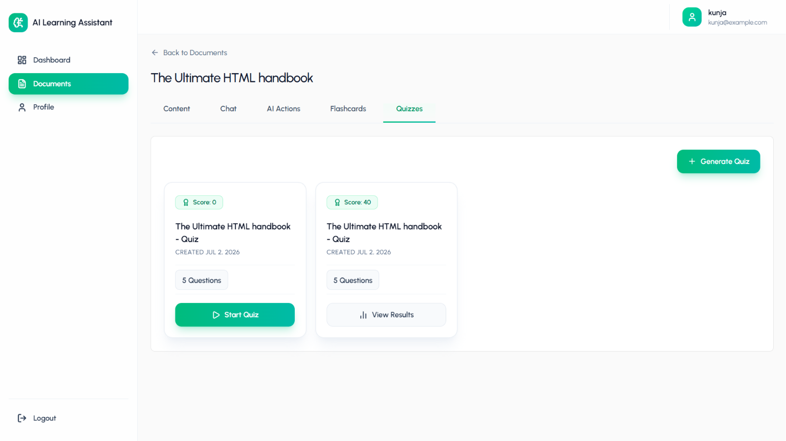
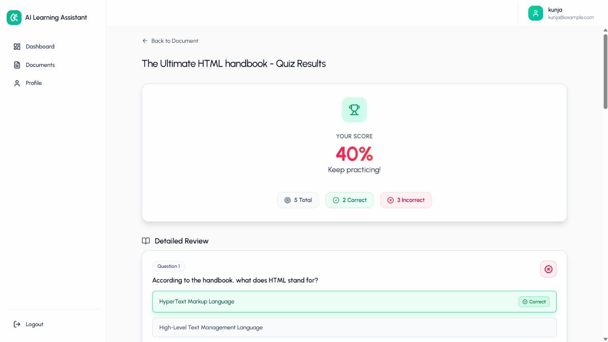

# 📚 AI Learning Assistant

Upload your study materials and let AI turn them into a full learning workflow — chat with your documents, get instant summaries and concept explanations, and auto-generate flashcards and quizzes to test yourself.

**Live App:** [ai-learning-assistant-ruby-chi.vercel.app](https://ai-learning-assistant-ruby-chi.vercel.app)

---

## 📖 Overview

Studying from raw PDFs and notes usually means re-reading the same pages, manually making flashcards, and guessing what to quiz yourself on. **AI Learning Assistant** turns any uploaded document into an interactive study companion: chat with it directly, ask for summaries or concept breakdowns, and generate flashcard sets and quizzes on demand — all tracked from a single dashboard.

It's built end-to-end on the **MERN stack** (MongoDB, Express, React, Node.js), with the frontend written in **JavaScript (JSX)** . Google's **Gemini API** powers all the AI functionality — chat, summaries, concept explanations, flashcard generation, and quiz generation.

---

## ✨ Features

- **Dashboard** — at-a-glance stats (total documents, flashcards, quizzes) plus a recent activity feed tracking document access and quiz attempts
- **Document Management** — upload study materials and view them all in one place, with per-document flashcard and quiz counts
- **Document Content Viewer** — paginated, extracted text view of the uploaded document
- **AI Chat** — ask follow-up questions about a specific document and get context-aware answers grounded in its content
- **AI Actions** — one-click **Generate Summary** for a concise overview of the whole document, plus **Explain a Concept** to get a detailed explanation of any topic you name from it
- **Flashcard Generation** — generate flashcard sets per document on demand, ready to review
- **Quiz Generation** — generate multiple-choice quizzes per document, take them, and track scores over multiple attempts
- **Quiz Results & Review** — see your score, correct/incorrect breakdown, and a detailed per-question review showing the correct answer
- **Profile Management** — manage user account details
- **JWT Authentication** — stateless, token-based session handling protects all document, flashcard, quiz, and profile routes

---

## 🏗️ Architecture



---

## 🛠️ Tech Stack

| Layer | Tech |
|---|---|
| Frontend | React (JavaScript/JSX), Vite — deployed on **Vercel** |
| Backend | Node.js, Express |
| Database | MongoDB |
| AI | Google **Gemini API** — chat, summaries, concept explanations, flashcard & quiz generation |
| File Uploads | Multer |
| Auth | JWT |

---

## 📁 Project Structure

```
ai-learning-assistant/
├── frontend/
│   └── ai-learning-assi.../
│       └── src/
│           ├── components/
│           ├── context/
│           ├── pages/
│           │   ├── Auth/
│           │   ├── Dashboard/
│           │   ├── Documents/
│           │   ├── Profile/
│           │   └── Quizzes/
│           ├── services/
│           └── utils/
└── backend/
    ├── config/
    ├── controllers/
    ├── middleware/
    ├── models/
    ├── routes/
    ├── uploads/
    │   └── documents/
    └── utils/
```

---

## 📸 Screenshots

**Dashboard**


**My Documents**


**Document Content View**


**AI Chat**


**AI Actions**


**Flashcards**


**Quizzes**


**Quiz Results**


---

## 🔄 How It Works

1. **Upload** a document (PDF, notes, etc.) from the **Documents** page.
2. **Read** through the extracted content in the **Content** tab.
3. **Chat** with the document to ask questions, or use **AI Actions** to generate a summary or explain a specific concept.
4. **Generate** a flashcard set or quiz for the document with one click.
5. **Take** the quiz, review your score and a detailed per-question breakdown, and retry to improve.
6. **Track** everything — documents, flashcards, quizzes, and recent activity — from the Dashboard.

---

## 🔌 API Overview

### Auth — `/api/auth`
| Method | Endpoint | Access | Purpose |
|---|---|---|---|
| POST | `/register` | Public | Register a new user (validated: email, password) |
| POST | `/login` | Public | Log in and receive a JWT (validated: email, password) |
| GET | `/profile` | Protected | Get the logged-in user's profile |
| PUT | `/profile` | Protected | Update the logged-in user's profile |
| POST | `/change-password` | Protected | Change the logged-in user's password |

### Documents — `/api/documents`
| Method | Endpoint | Access | Purpose |
|---|---|---|---|
| POST | `/upload` | Protected | Upload a document (Multer, single `file` field) |
| GET | `/` | Protected | List all documents for the user |
| GET | `/:id` | Protected | Get a single document by ID |
| DELETE | `/:id` | Protected | Delete a document by ID |

### AI — `/api/ai`
| Method | Endpoint | Access | Purpose |
|---|---|---|---|
| POST | `/generate-flashcards` | Protected | Generate a flashcard set from a document |
| POST | `/generate-quiz` | Protected | Generate a quiz from a document |
| POST | `/generate-summary` | Protected | Generate a document summary |
| POST | `/chat` | Protected | Chat with a document |
| POST | `/explain-concept` | Protected | Get a detailed explanation of a concept |
| GET | `/chat-history/:documentId` | Protected | Get chat history for a document |

### Flashcards — `/api/flashcards`
| Method | Endpoint | Access | Purpose |
|---|---|---|---|
| GET | `/` | Protected | List all flashcard sets |
| GET | `/:documentId` | Protected | Get flashcards for a specific document |
| POST | `/:cardId/review` | Protected | Submit a review result for a flashcard |
| PUT | `/:cardId/star` | Protected | Toggle star/favorite on a flashcard |
| DELETE | `/:id` | Protected | Delete a flashcard set |

### Quizzes — `/api/quizzes`
| Method | Endpoint | Access | Purpose |
|---|---|---|---|
| GET | `/:documentId` | Protected | List quizzes for a document |
| GET | `/quiz/:id` | Protected | Get a single quiz by ID |
| POST | `/:id/submit` | Protected | Submit answers for a quiz attempt |
| GET | `/:id/results` | Protected | Get results for a quiz attempt |
| DELETE | `/:id` | Protected | Delete a quiz |

### Progress — `/api/progress`
| Method | Endpoint | Access | Purpose |
|---|---|---|---|
| GET | `/dashboard` | Protected | Get dashboard stats and recent activity feed |

> All protected routes require a valid JWT via the `protect` middleware, passed in the `Authorization` header.

---

## 🔐 Security Notes

- JWTs are issued on login and required on all protected routes via an `Authorization` header
- Uploaded documents are stored server-side via Multer, not exposed directly to other users
- The Gemini API key lives server-side only and is never exposed in the client bundle

---

## ⚙️ Getting Started

### Prerequisites
- Node.js (v18+)
- MongoDB connection string
- API key: Google Gemini

### Backend Setup
```bash
cd backend
npm install
```

Create a `.env` file:
```env
PORT=5000
MONGODB_URI=your_mongodb_connection_string
JWT_SECRET=your_jwt_secret
CLIENT_URL=http://localhost:5173

GEMINI_API_KEY=your_gemini_api_key
```

```bash
npm run dev
```

### Frontend Setup
```bash
cd frontend/ai-learning-assi...
npm install
```

Create a `.env` file:
```env
VITE_API_URL=http://localhost:5000
```

```bash
npm run dev
```

---

## 🗺️ Roadmap

- [ ] Spaced-repetition scheduling for flashcards
- [ ] Support for more file types (docx, pptx)
- [ ] Progress analytics and quiz score trends over time
- [ ] Shareable flashcard/quiz sets between users
- [ ] Adaptive quiz difficulty based on past performance

---

## 🙏 Acknowledgments

- [Google Gemini](https://ai.google.dev/) — AI chat, summarization, and generation

---

*Built by Arijit Roy*
