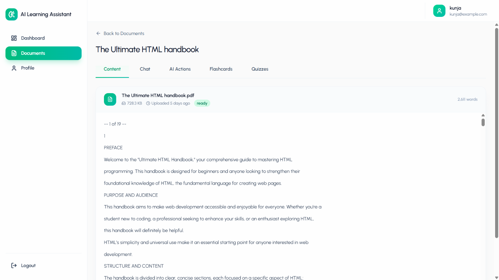
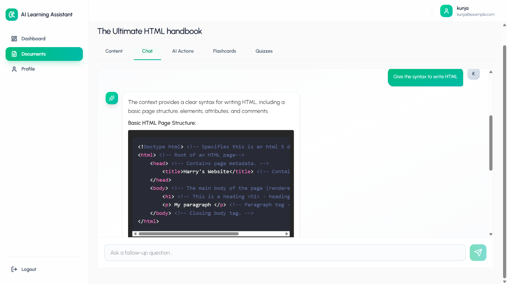

# 📚 AI Learning Assistant

Upload your **PDF study materials** and let AI transform them into an interactive learning companion. Chat with documents, generate summaries, explain concepts, and automatically create flashcards and quizzes.

**🌐 Live Demo:** https://ai-learning-assistant-ruby-chi.vercel.app

---

# 📑 Table of Contents

- Overview
- Features
- Architecture
- Tech Stack
- Project Structure
- Screenshots
- How It Works
- API Overview
- Security
- Static File Serving
- Deployment
- Getting Started
- Roadmap

---

# 📖 Overview

AI Learning Assistant is a full-stack MERN application that helps students learn more effectively from PDF study materials.

Instead of repeatedly reading notes, users can upload a document and immediately:

- Chat with the document
- Generate summaries
- Explain difficult concepts
- Create flashcards
- Generate MCQ quizzes
- Track learning progress

The project is built using **React (JavaScript)**, **Node.js**, **Express**, **MongoDB**, and **Google Gemini API**.

---

# ✨ Features

## Dashboard
- Learning statistics
- Recent activity
- Flashcard and quiz counts

## Document Management
- Upload PDF documents
- Organize study material
- Delete documents

## Document Viewer
- Paginated extracted text viewer

## AI Features
- Context-aware document chat
- AI Summary
- Explain Concept

## Flashcards
- Automatic generation
- Star important cards
- Review tracking

## Quizzes
- AI-generated MCQs
- Multiple attempts
- Detailed review

## Profile
- Update profile
- Change password

## Authentication
- JWT authentication
- Protected API routes

---

# 🏗️ Architecture

```mermaid
flowchart LR
Client --> Express
Express --> MongoDB
Express --> Gemini
Express --> Multer

------------------------------------------------------------------------

# 🛠️ Tech Stack

  Layer            Technology
  ---------------- -------------------------
  Frontend         React, Vite, JavaScript
  Backend          Node.js, Express
  Database         MongoDB Atlas
  Authentication   JWT
  AI               Google Gemini API
  Uploads          Multer
  Deployment       Vercel + Render

------------------------------------------------------------------------

# 📁 Project Structure

``` text
ai-learning-assistant/
├── frontend/
│   └── src/
├── backend/
│   ├── config/
│   ├── controllers/
│   ├── middleware/
│   ├── models/
│   ├── routes/
│   ├── uploads/
│   │   └── documents/
│   └── utils/
├── screenshots/
└── README.md
```

------------------------------------------------------------------------

# 📸 Screenshots

Create a folder named **screenshots** in the project root and add these
files.

### Dashboard


### Documents


### Document Viewer



### AI Chat



### AI Actions


### Flashcards


### Quizzes


### Quiz Results


------------------------------------------------------------------------

# 🔄 How It Works

1.  Upload a PDF.
2.  Read extracted content.
3.  Chat with the document.
4.  Generate summaries.
5.  Explain concepts.
6.  Generate flashcards.
7.  Generate quizzes.
8.  Review results.
9.  Track progress.

------------------------------------------------------------------------

# 🔌 API Overview

## Authentication (`/api/auth`)

  Method   Endpoint
  -------- ------------------
  POST     /register
  POST     /login
  GET      /profile
  PUT      /profile
  POST     /change-password

## Documents (`/api/documents`)

  Method   Endpoint
  -------- ----------
  POST     /upload
  GET      /
  GET      /:id
  DELETE   /:id

## AI (`/api/ai`)

  Method   Endpoint
  -------- ---------------------------
  POST     /generate-summary
  POST     /generate-flashcards
  POST     /generate-quiz
  POST     /chat
  POST     /explain-concept
  GET      /chat-history/:documentId

## Flashcards (`/api/flashcards`)

GET `/` • GET `/:documentId` • POST `/:cardId/review` • PUT
`/:cardId/star` • DELETE `/:id`

## Quizzes (`/api/quizzes`)

GET `/:documentId` • GET `/quiz/:id` • POST `/:id/submit` • GET
`/:id/results` • DELETE `/:id`

## Progress (`/api/progress`)

GET `/dashboard`

All protected routes require a valid JWT Bearer token.

------------------------------------------------------------------------

# 🔐 Security

-   JWT authentication
-   Password hashing
-   Protected API routes
-   Gemini API key stored only on the backend
-   CORS configured for deployed frontend and localhost
-   PDF uploads handled with Multer

------------------------------------------------------------------------

# 📂 Static File Serving

Uploaded files are stored in:

``` text
backend/uploads/documents/
```

and served through:

``` text
/uploads
```

------------------------------------------------------------------------

# 🚀 Deployment

  Service    Platform
  ---------- ---------------
  Frontend   Vercel
  Backend    Render
  Database   MongoDB Atlas

------------------------------------------------------------------------

# ⚙️ Getting Started

## Backend

``` bash
cd backend
npm install
```

Create `.env`

``` env
PORT=8000
MONGODB_URI=your_connection_string
JWT_SECRET=your_secret
CLIENT_URL=http://localhost:5173
GEMINI_API_KEY=your_api_key
```

Run

``` bash
npm run dev
```

## Frontend

``` bash
cd frontend
npm install
```

Create `.env`

``` env
VITE_API_URL=http://localhost:8000
```

Run

``` bash
npm run dev
```


# 👨‍💻 Author

**Arijit Roy**

If you like this project, consider giving it a ⭐ on GitHub.
